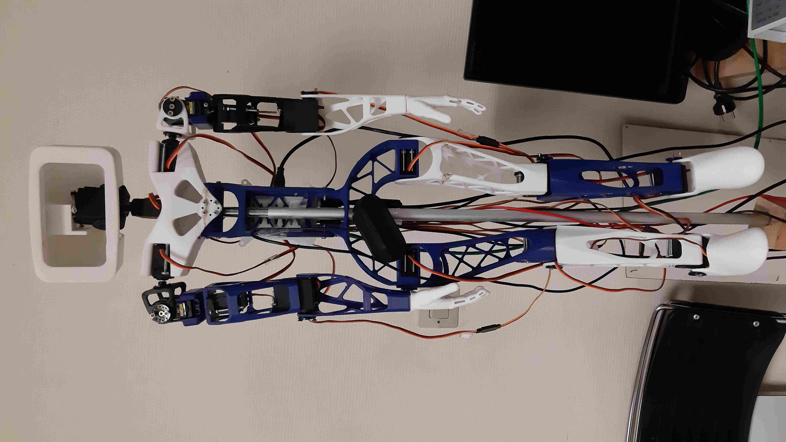

# Personnalisation du projet BlocklyPi

Ce guide permet de définir la procédure pour personnaliser ce fork du projet BlocklyPi, à savoir ajouter des blocs, des
boîtes à outils et permettre à ces composants d'interagir avec le port GPIO du Raspberry Pi. Ces instructions sont
spécifiques au projet actuel et servent de mémo pour faciliter sa personnalisation, dans le cadre des missions réalisées
par les Francas de Seine-Maritime.

Si vous êtes débutant avec ce projet, lisez le guide de [Blockly](https://developers.google.com/blockly/guides/overview)
pour avoir un guide faisant le tour des principaux concepts. Les notions de programmation en bloc, toolbox, workspace ou
autres demandent à être comprises pour suivre ce guide, et ne seront pas redéfinies ici.

## Contribution

### Architecture du projet

Le projet est constitué de 2 parties :

- Un frontend écrit en JavaScript qui fournit une interface à l'utilisateur pour communiquer avec son robot.
- Un backend écrit en Python qui permet de communiquer avec le port GPIO du Raspberry Pi.

Ces 2 composants utilisent un serveur [XML-RPC](https://fr.wikipedia.org/wiki/XML-RPC) pour communiquer. Il doit être
instancié en exécutant la commande `python3 server.py` à la racine du projet.

Pour ce qui nous intéresse concernant l'ajout d'actions à nos robots, voici l'arborescence du projet :

- `BlocklyPi/`
    - `blockly/`
        - `blocks/`
            - `robot.js` : Le script contenant le code de définition des blocs.
        - `generators/`
            - `robot.js` : Le script contenant les générateurs de code des blocs associés.
    - `robot/`
        - `robotController.py` : Le module contenant toutes les actions qu'un robot donné est capable d'exécuter.
        - `robotMotor.py` : Une classe contenant tout le code de base permettant de contrôler un servomoteur donné.
    - `server.py` : Le script où nous allons instancier notre serveur XML-RPC et définir l'ensemble des fonctions qu'il
      peut interpréter.

### Ajout d'une nouvelle catégorie à la boîte à outils

La boîte à outils par défaut utilisée par le projet est dans le fichier
[index.html](../index.html). Chaque nouvelle catégorie doit être placée dans ce fichier, dans la balise `<xml>`.

Une catégorie a la syntaxe suivante :

 ```xml

<category name="robot_category" colour="#ff8000">
    <block type="robot_name-action_name1"></block>
    <block type="robot_name-action_name2"></block>
    <!---etc.-->
</category>
 ```

### Création d'un bloc

Le code décrivant un bloc a 3 composantes :

- La déclaration du bloc dans la boîte à outils : Elle permet de rendre visible le bloc dans la catégorie de son choix.
- La déclaration de l'interface utilisateur du bloc : L'apparence et toutes les possibilités d'interaction de
  l'utilisateur avec le bloc :
    - Sa couleur.
    - Ses éléments descriptifs (textes, images, etc).
    - Ses paramètres (entrées de valeurs, déclarations d'autres blocs, etc).
- Le générateur de code associé au bloc : Le composant chargé d'appeler la fonction liée à l'action que l'utilisateur
  souhaite exécuter, en prenant en compte les paramètres de l'utilisateur.

Par convention, le nom des blocs et de toutes les fonctions qui leur sont associées doivent respecter le format
suivant : `"robot_name-action_name"`. Tous les blocs d'une même catégorie devront avoir la même teinte, qui pourra être
définie par une constante `ROBOT_COLOR` dans le script de définition des blocs de cette catégorie,
dans `blockly/blocks/`.

#### Définition et générateur de code du bloc

Pour faciliter l'écriture du code définissant le comportement de notre bloc, nous pouvons utiliser
l'outil [Blockly Factory](https://blockly-demo.appspot.com/static/demos/blockfactory/index.html).


Exemple de déclaration de bloc (en **rouge** sur la capture d'écran) :

```js
Blockly.Blocks['robot_name-action_name'] = {
    init: function () {
        this.appendValueInput("VALUE1");
        this.appendValueInput("VALUE2");
        this.setPreviousStatement(true, null);
        this.setNextStatement(true, null);
        this.setColour(ROBOT_COLOR);
        this.setTooltip("");
        this.setHelpUrl("");
    }
};
```

Le générateur de bloc (en **bleu** sur la capture d'écran) devra toujours respecter ce format :

```js
Blockly.JavaScript['robot_name-action_name'] = function (block) {
    var arg1 = Blockly.JavaScript.valueToCode(block, 'VALUE1', Blockly.JavaScript.ORDER_ATOMIC);
    var arg2 = Blockly.JavaScript.valueToCode(block, 'VALUE2', Blockly.JavaScript.ORDER_ATOMIC);
    return `runPiRobotCommand("robot_name-action_name", "${arg1}", "${arg2}");`;
};
```

`runPiRobotCommand` est la commande utilisée pour communiquer avec le serveur XML-RPC. Ses arguments sont le nom de la
fonction appelée dans le backend, ainsi que la liste des valeurs de ses paramètres.

Une fois le bloc créé, différents morceaux de code sont à insérer dans le projet de la manière suivante :

- La définition du bloc : [`blockly/blocks`](../blockly/blocks).
- Le générateur de code du bloc : [`blockly/generators/javascript`](../blockly/generators/javascript).
- La ligne `<block type="robot_name-action_name"></block>` : [`index.html`](../index.html), au sein de la catégorie
  voulue.

Ne pas oublier de faire appel à ces scripts, en ajoutant dans la balise `<head>` de [`index.html`](../index.html):

- `<script src="blockly/blocks/francaster.js"></script>`
- `<script src="blockly/generators/javascript/francaster.js"></script>`

#### Déclaration et description d'une fonction côté backend

Toutes les fonctions relatives à un robot doivent être décrites dans un module `robotController.py` dans `robot/`.
Chaque action que le robot peut exécuter est décrite par une fonction de la manière suivante :

```Python
def action_name(arg1: str, arg2: str):
# actions...
```

Pour que la fonction soit reconnue par le serveur XML-RPC, assurez-vous que votre module est bien importé
dans `server.py`, puis ajouter la ligne de déclaration suivante :

```Python
from xmlrpc.server import SimpleXMLRPCRequestHandler, SimpleXMLRPCServer
from robot import robotController  # le module de votre contrôleur


def register_robot_xmlrpc_methods(server: SimpleXMLRPCServer):
    server.register_function(robotController.action_name, 'robot_name-action_name')  # Ajouter ici
    # ...
```

### Configuration du matériel

Le Raspberry Pi utilise une carte de commande
nommée [pca9685](https://www.aranacorp.com/en/using-a-pca9685-module-with-raspberry-pi/) pour pouvoir piloter les
moteurs du robot depuis son port GPIO. Chaque moteur est nommé selon le numéro du connecteur sur lequel il est branché
sur cette carte. C'est le numéro à indiquer lorsque l'on instancie un moteur dans le module de contrôle du robot à
l'aide de la classe `RobotMotor`, dans le champ `id`.

### Déploiement

Le dossier du projet peut simplement être placé dans le répertoire personnel de l'utiliser (`~/BlocklyPi`). Des
informations plus détaillées sont déjà présentes dans le [README](../README.md) du projet. Si le code est mis à jour
vers une nouvelle version, il peut arriver que les changements soient mal pris en compte. La meilleure solution dans ce
cas est de redémarrer le système et de relancer le serveur XML-RPC.

## Robots

Comme chaque robot est censé être commandable à l'aide d'une interface graphique, on a besoin de connecter au
Raspberry Pi installé sur le robot les éléments suivants :

- Un écran, avec son cable d'alimentation et vidéo.
- Un clavier.
- Une souris.
- Un micro USB.
- Une petite enceinte.
- Une alimentation pour le Raspberry Pi.
- Une alimentation adaptée aux moteurs du robot, à brancher sur le shield du Raspberry Pi.

Veillez à ce que la tension de l'alimentation soit adaptée aux moteurs, et à ce que l'intensité électrique disponible
soit suffisante pour les alimenter. Si lors de l'exécution, le Robot se fige en plein mouvement, ou que le Raspberry Pi
redémarre subitement, alors il faut opter pour une alimentation plus puissante à tension égale, c'est-à-dire avec une
plus grande intensité électrique disponible.

### Francaster



Francaster est le nom donné au robot dont le modèle est celui d'Aster, un androïde dont les différentes parties du corps
sont imprimables en 3D.

Liens utiles :
- [Thingiverse](https://www.thingiverse.com/thing:3992150)
- [GitHub](https://github.com/poppy-project/poppy-humanoid)
- [poppy-project.org](https://www.poppy-project.org/en/robots/poppy-humanoid/)

### Allbots


Allbots est un robot à quatre pattes imprimable en 3D, dont l'apparence peut faire penser à une araignée ou à un crabe.

Liens utiles :
- [Thingiverse](https://www.thingiverse.com/thing:1434665)
- [Manuel](https://manuals.whadda.com/category.php?id=85)